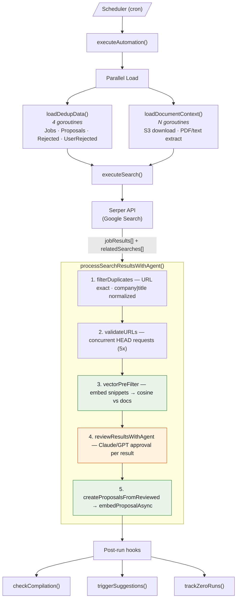
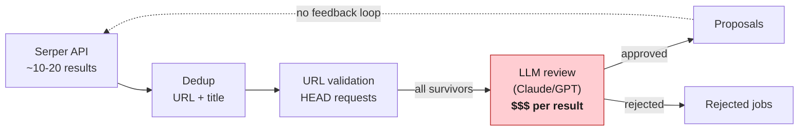
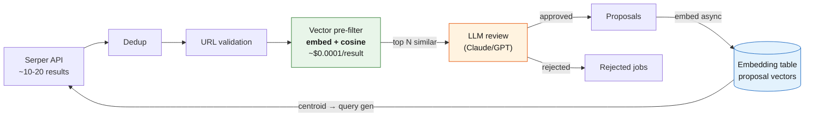
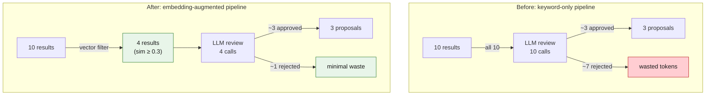
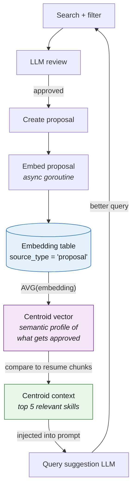
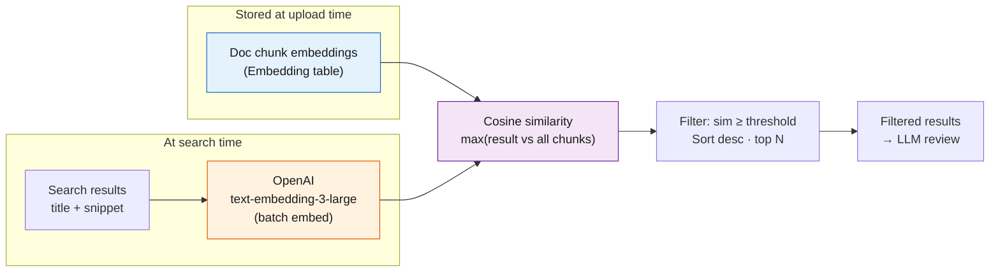
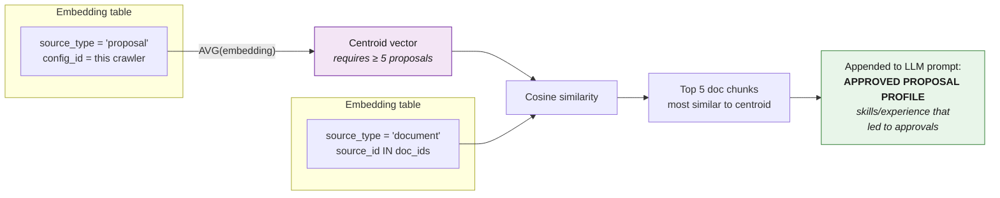
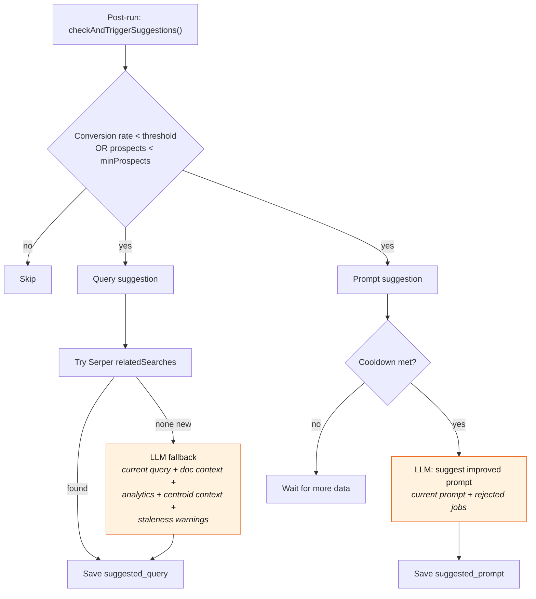
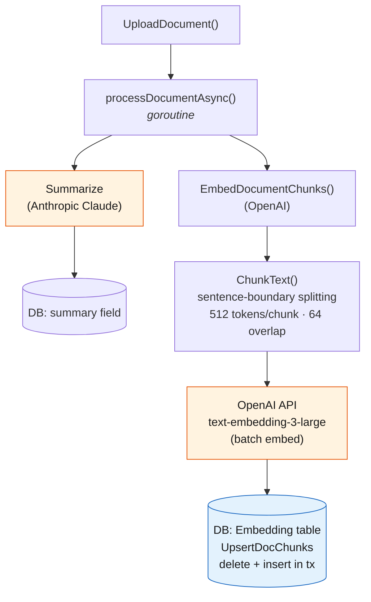
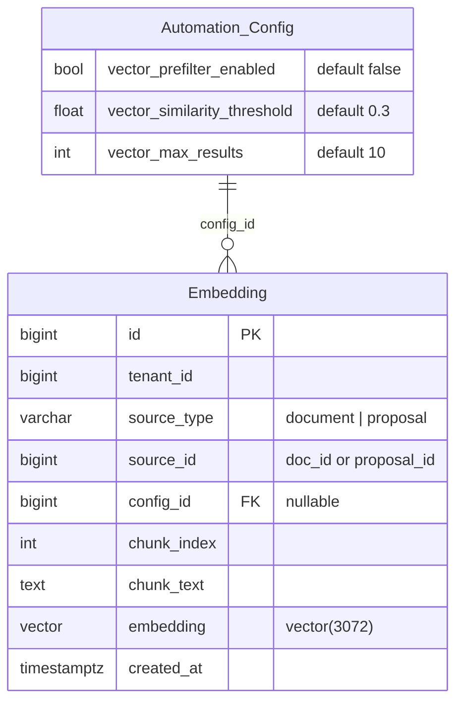

# PinaColada CRM Architecture

## Table of Contents

- [Description](#description)
- [System Overview](#system-overview)
  - [Key Components](#key-components)
  - [Tools](#tools)
  - [Handoff Mechanism](#handoff-mechanism)
  - [Per-User Configuration](#per-user-configuration)
- [Crawler Architecture](#crawler-architecture)
  - [Pipeline Overview](#pipeline-overview)
  - [How Embeddings Improved the Pipeline](#how-embeddings-improved-the-pipeline)
    - [Before: keyword-only pipeline](#before-keyword-only-pipeline)
    - [After: embedding-augmented pipeline](#after-embedding-augmented-pipeline)
    - [Before vs after](#before-vs-after)
  - [The Feedback Loop](#the-feedback-loop)
  - [Vector Pre-Filter Detail](#vector-pre-filter-detail)
  - [Centroid-Informed Query Generation](#centroid-informed-query-generation)
  - [Query & Prompt Suggestion Flows](#query--prompt-suggestion-flows)
  - [Document Embedding Flow](#document-embedding-flow)
  - [Data Model](#data-model)
  - [LLM Usage Summary](#llm-usage-summary)
- [License](#license)

---

## Description

PinaColada is an AI-native CRM built on the OpenAI Agents Go SDK that manages relationships and workflows through natural conversation. Core entities include Contacts, Leads, Deals, Opportunities, Organizations, and Jobs. The system uses a triage agent with handoffs to specialized workers, all driven by conversational AI rather than traditional forms and dashboards.

## System Overview

```
┌─────────────────────────────────────────────────────────────────────┐
│                         FRONTEND (pinacolada.co)                    │
│                         WebSocket Client                            │
│  • Real-time streaming responses                                    │
│  • Token usage display (current/cumulative)                         │
└──────────────────────────┬──────────────────────────────────────────┘
                           │
                           ▼
┌─────────────────────────────────────────────────────────────────────┐
│                    GO HTTP SERVER (Chi + Gorilla WS)                │
│                    cmd/agent/main.go                                │
│  • REST endpoints (/agent/chat)                                     │
│  • WebSocket streaming (/ws)                                        │
│  • Token usage tracking                                             │
└──────────────────────────┬──────────────────────────────────────────┘
                           │
                           ▼
┌─────────────────────────────────────────────────────────────────────┐
│                    ORCHESTRATOR                                     │
│                    internal/agent/orchestrator.go                   │
│                                                                     │
│  • Manages agent lifecycle                                          │
│  • Per-user model/settings via ConfigCache                          │
│  • Conversation state (memory + DB persistence)                     │
│  • Token usage accumulation                                         │
└──────────────────────────┬──────────────────────────────────────────┘
                           │
                           ▼
┌─────────────────────────────────────────────────────────────────────┐
│                    TRIAGE AGENT (OpenAI Agents SDK)                 │
│                    (user-configurable model, default gpt-4o)        │
│                                                                     │
│  • Intent-based routing via native handoff mechanism                │
│  • Routes to exactly ONE worker per message                         │
│  • "search jobs" → job_search | "my leads" → crm | else → general   │
└──────────────────────────┬──────────────────────────────────────────┘
                           │
         ┌─────────────────┼─────────────────┐
         ▼                 ▼                 ▼
┌─────────────────┐ ┌─────────────────┐ ┌─────────────────┐
│  JOB SEARCH     │ │   CRM WORKER    │ │  GENERAL WORKER │
│  WORKER         │ │                 │ │                 │
│                 │ │ • crm_lookup    │ │ • crm_lookup    │
│ • job_search    │ │ • crm_list      │ │ • read_document │
│ • send_email    │ │ • crm_propose_* │ │ • Q&A           │
│ • crm_lookup    │ │ • read_document │ │                 │
│ • read_document │ │                 │ │                 │
└────────┬────────┘ └────────┬────────┘ └────────┬────────┘
         │                   │                   │
         └───────────────────┴───────────────────┘
                             │
                             ▼
┌─────────────────────────────────────────────────────────────────────┐
│                    EVALUATOR (Optional)                             │
│                    internal/agent/evaluator.go                      │
│                    (Claude, when ANTHROPIC_API_KEY set)             │
│                                                                     │
│  • Scores response 0-100                                            │
│  • Types: Career | CRM | General                                    │
│  • If score < 60 → retry agent with feedback                        │
└──────────────────────────┬──────────────────────────────────────────┘
                           │
                           ▼
                      ┌──────────┐
                      │  DONE    │
                      │ (Stream) │
                      └──────────┘
```

### Key Components

| Component        | Path                             | Purpose                                |
| ---------------- | -------------------------------- | -------------------------------------- |
| **Orchestrator** | `internal/agent/orchestrator.go` | Agent lifecycle, config, state         |
| **Workers**      | `internal/agent/workers/`        | Specialized agents with filtered tools |
| **Tools**        | `internal/agent/tools/`          | CRM, Serper, Document, Email tools     |
| **Prompts**      | `internal/agent/prompts/`        | Centralized prompt definitions         |
| **State**        | `internal/agent/state/`          | Memory + DB persistence                |
| **Evaluator**    | `internal/agent/evaluator.go`    | Optional quality control (Claude)      |

### Tools

```
┌─────────────────────────────────────────────────────────────────────┐
│                         AVAILABLE TOOLS                             │
├─────────────────────────────────────────────────────────────────────┤
│  CRM Tools                     │  External Tools                    │
│  • crm_lookup    (read)        │  • job_search    (Serper API)      │
│  • crm_list      (list)        │  • send_email    (notifications)   │
│  • crm_propose_create          │  • read_document (resumes, PDFs)   │
│  • crm_propose_update          │                                    │
│  • crm_propose_delete          │                                    │
└─────────────────────────────────────────────────────────────────────┘

┌─────────────────────────────────────────────────────────────────────┐
│                    TOOL ACCESS BY WORKER                            │
├──────────────────┬──────────────────┬───────────────────────────────┤
│  job_search      │  crm_worker      │  general_worker               │
├──────────────────┼──────────────────┼───────────────────────────────┤
│  ✓ job_search    │  ✗ job_search    │  ✗ job_search                 │
│  ✓ send_email    │  ✗ send_email    │  ✗ send_email                 │
│  ✓ crm_lookup    │  ✓ crm_lookup    │  ✓ crm_lookup                 │
│  ✗ crm_list      │  ✓ crm_list      │  ✗ crm_list                   │
│  ✗ crm_propose_* │  ✓ crm_propose_* │  ✗ crm_propose_*              │
│  ✓ read_document │  ✓ read_document │  ✓ read_document              │
└──────────────────┴──────────────────┴───────────────────────────────┘
```

Workers receive filtered tool sets via `tools.FilterTools()` to enforce separation of concerns.

### Handoff Mechanism

The triage agent uses the OpenAI Agents SDK's native **handoff** feature to route requests. When the triage agent determines which worker should handle a message, it triggers a handoff—transferring full conversation context and control to that worker. The worker then executes with its own model settings and filtered tool set. This is a single-hop delegation (triage → worker), not a multi-agent orchestration loop.

### Per-User Configuration

- Model selection per node (triage, each worker, evaluator)
- LLM settings: temperature, top_p, max_tokens, penalties
- Provider: OpenAI (primary) or Anthropic

---

## Crawler Architecture

The automation crawler searches for job listings, evaluates relevance via LLM, and creates proposals. It runs on a configurable interval per crawler and supports self-healing (query/prompt suggestions, auto-pause on compilation).

### Pipeline Overview



### How Embeddings Improved the Pipeline

#### Before: keyword-only pipeline



Every result that passed dedup and URL checks went straight to the LLM for a full review. A typical run sent 8-15 results to Claude, but only 2-4 were relevant. The rest were obvious mismatches (wrong industry, wrong seniority, unrelated role) that a human would dismiss at a glance. Each wasted review burned ~2K tokens of input + output.

Query suggestions relied entirely on keyword heuristics (Serper related searches) or an LLM generating queries with only the system prompt and document text as context. The LLM had no signal about what kinds of jobs had actually been approved in the past.

#### After: embedding-augmented pipeline



The vector pre-filter embeds each result's `title + snippet` and compares against source document embeddings (resumes). Only semantically similar results pass through to the LLM.

Approved proposals are embedded and stored. Over time, their centroid vector becomes a semantic fingerprint of "what this crawler approves," which is injected into query suggestion prompts.

#### Before vs after



| Metric                   | Before                        | After                               |
| ------------------------ | ----------------------------- | ----------------------------------- |
| Results sent to LLM      | All post-dedup (~8-15)        | Only semantically similar (~3-6)    |
| LLM tokens per run       | ~20K-40K                      | ~8K-16K                             |
| LLM cost per run         | ~$0.01-0.02                   | ~$0.004-0.008                       |
| Embedding cost per run   | $0                            | ~$0.0002 (batch embed)              |
| Query suggestion context | System prompt + doc text only | + centroid-informed skill profile   |
| Learning from approvals  | None                          | Centroid refines with each approval |

### The Feedback Loop

The key architectural shift is that the system now learns from its own approvals:



1. **Runs 1-4**: No centroid yet. Pre-filter uses document embeddings only. Query suggestions are document-context only.
2. **Runs 5+**: Centroid activates. The system knows e.g. "this crawler approves backend engineering roles with distributed systems experience." The query suggestion LLM receives this as concrete context.
3. **Runs 10+**: Centroid stabilizes. Pre-filter becomes more precise as the approval profile sharpens. Query suggestions increasingly target the niche the crawler has converged on.

### Vector Pre-Filter Detail



- **Model**: `text-embedding-3-large` (3072 dimensions)
- **Config**: `vector_similarity_threshold` (default 0.3), `vector_max_results` (default 10)

### Centroid-Informed Query Generation



### Query & Prompt Suggestion Flows



### Document Embedding Flow



### Data Model



**Indexes**: `(source_type, source_id)`, `(config_id)`

### LLM Usage Summary

| Call Site                      | Model                            | Purpose                              | Max Tokens |
| ------------------------------ | -------------------------------- | ------------------------------------ | ---------- |
| `reviewResultsWithAgent`       | Claude Sonnet 4.5 (default)      | Approve/reject search results        | 2048       |
| `generateQueryWithLLM`         | Claude Sonnet 4.5 / configurable | Suggest new search query             | 1024       |
| `generatePromptSuggestion`     | Claude Sonnet 4.5 / configurable | Suggest improved system prompt       | 1024       |
| `EmbedTexts` (pre-filter)      | OpenAI text-embedding-3-large    | Embed search snippets for similarity | N/A        |
| `EmbedDocumentChunks`          | OpenAI text-embedding-3-large    | Embed uploaded documents             | N/A        |
| `EmbedProposal`                | OpenAI text-embedding-3-large    | Embed approved proposals             | N/A        |
| `ProcessDocument` (summarizer) | Claude (Anthropic)               | Summarize uploaded documents         | varies     |

## License

MIT
